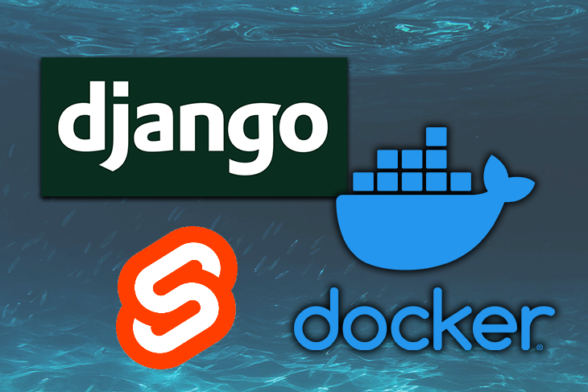
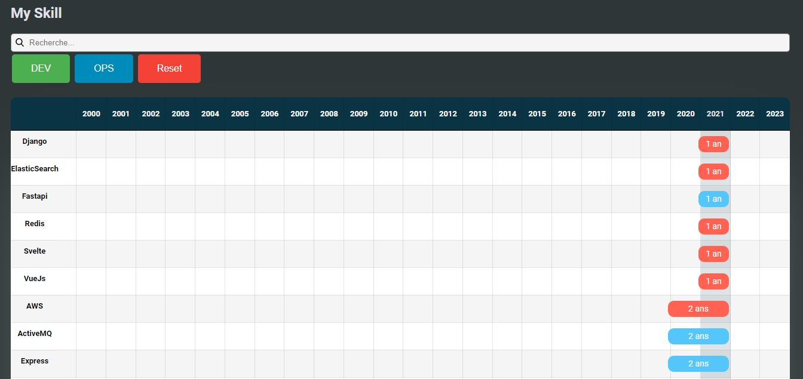

## Application Svelte + Django rest Framework

Petite application pour référencer ses compétences, possibilités d'ajouter des projets, pour chaque techno.

<a href="https://techprez.tk/" target="_blank">DEMO</a>

## Exemple

## Versions

**Dernière version stable :** 1.0
**Dernière version :** 1.0

## Auteurs
Listez le(s) auteur(s) du projet ici !
* _**Moi**_

## Todo 

* Auth avec JWT
* Mettre en place du responsive
* Ecran de saisie des Skills
* Ecran de saisie des projets
* Migration de BDD Sqlite > postgres || mongodb (atlas)
